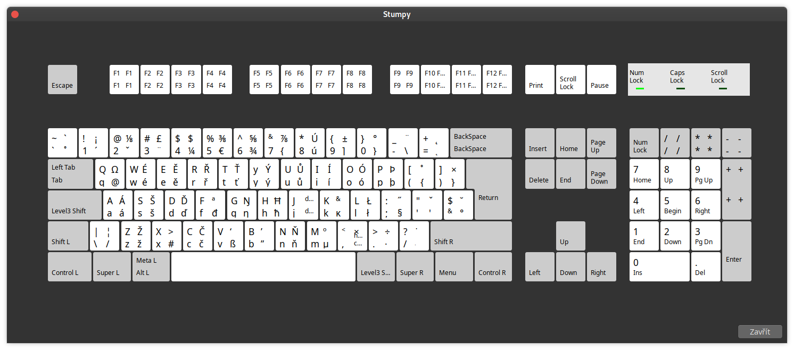

# stumpy

Stumpy klávesnice pro Windows nebo Linux



- Česká klávesnice určená pro snadnější programování.
- Háčky a čárky se píší přes AltGr, doporučuji přemapovat na CapsLock (na Windows doporučuji pomocí [SharpKeys](https://www.randyrants.com/category/sharpkeys/))
- Jinak je rozložení založeně na americké klávesnici

## Instalace Windows

1. Rozbalte `stumpy.zip`
2. Nainstalujte pomocí `setup.exe`

## Instalace Linux

1. Nakopírujte soubor Stumpy do `/usr/share/X11/xkb/symbols/`
2. Přidejte layout do `/usr/share/X11/xkb/rules/evdev.xml`

```
<layout>
  <configItem>
    <name>stumpy</name>
    <shortDescription>stumpy</shortDescription>
    <description>Stumpy</description>
    <languageList>
      <iso639Id>ces</iso639Id>
    </languageList>
  </configItem>
</layout>
```
